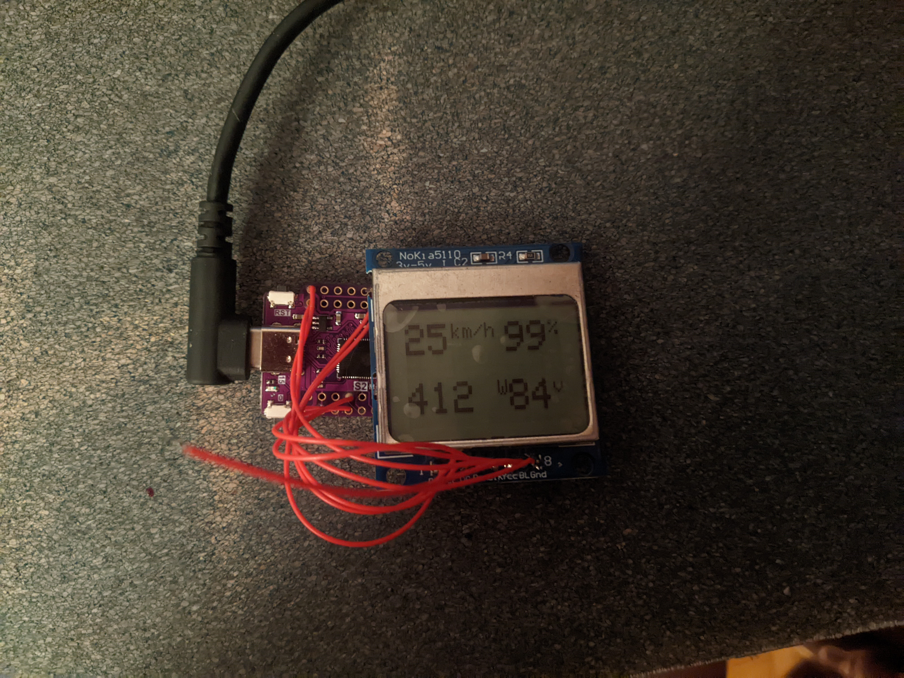

# VESC ESP32 dashboard

This repository contains code for ESP32 board with Nokia 5110 display to let it use as dashboard for any VESC based ESC.
Compatible with FW5.3

## THIS REPO IS JUST A DRAFT AND NOT TESTED

 
 

## Features

Display battery level, power and speed based on VESC data.
Transparent BLE-UART proxy for VESC tool.

## Usage

1. Modify `src/config.h` according to your specifications.
2. Connect `3V` or `5V` pin to VESC.
   1. Optional: I recommend you to use 10µF capacitor between `V+` and `G` pin to avoid unstable behavior.
3. Connect `G` pin to VESC `Ground`.
4. Connect `RX` pin to VESC `TX` and `TX` pin to VESC `RX`.
5. Now you can use your module as dashboard and bluetooth relay.

**Use buttons**

I'm using the first button to control the light, so pin name is `LIGHT_PIN`. The button can be used in two modes: as switch and pass-through.

In Switch mode button will toggle the flag, while flag is `TRUE`, `LIGHT_PIN` will be `HIGH`.
In pass-through mode button will pass-through the state. Normal state is `HIGH`.

 
 
